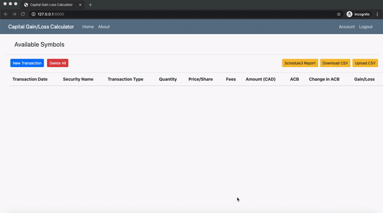

Calculate Capital Gains/Loss for Canadian Taxes including Adjusted Cost Base using an interactive web-application implemented using FLASK (Python)

**Features**

- Simple UI to add Buy/Sell transactions
- Add commission, forex charges etc
- Auto calculate USD->CAD exchange rate for historical dates using Bank of Canada exchange rate
- Calcuate brokerage commission in forex changes
- Download the data as CSV
- Upload existing data from CSV

**Setup**

`git clone https://github.com/sarbjit87/capital_gains_loss.git`

`pip install -r requirements.txt`

`export FLASK_APP=capital_gains_loss`

`flask db init`

`flask db migrate`

`flask db upgrade`

`python3 run.py`

Live Demo Link : https://acbcalculator.herokuapp.com

**Screenshot**

**DISCLAIMER**

THE CODE IS BEING PROVIDED FOR INFORMATIONAL PURPOSES ONLY.

USE ON YOUR OWN RISK. THIS SOFTWARE IS PROVIDED BY THE COPYRIGHT HOLDER OR CONTRIBUTORS "AS IS" AND ANY EXPRESS OR IMPLIED WARRANTIES, INCLUDING, BUT NOT LIMITED TO, THE IMPLIED WARRANTIES OF MERCHANTABILITY AND FITNESS FOR A PARTICULAR PURPOSE ARE DISCLAIMED. IN NO EVENT SHALL THE COPYRIGHT HOLDER OR CONTRIBUTORS BE LIABLE FOR ANY DIRECT, INDIRECT, INCIDENTAL, SPECIAL, EXEMPLARY, OR CONSEQUENTIAL DAMAGES

THIS REPO IS RELEASED WITH NO WARRANTY AT ALL.
